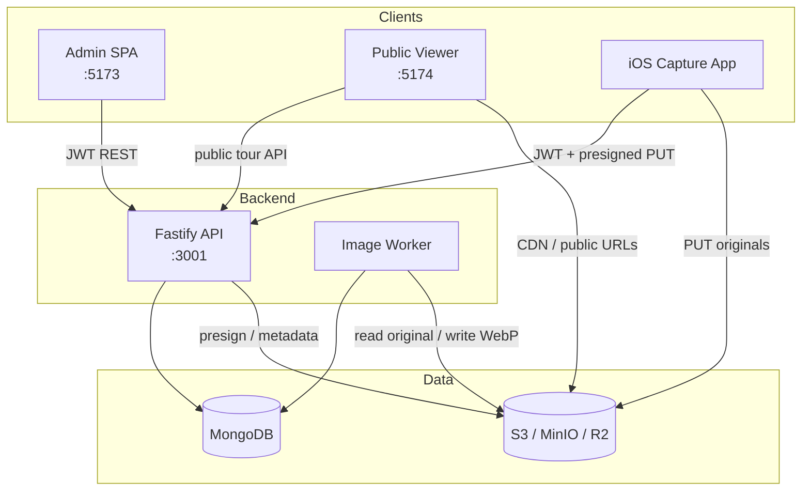
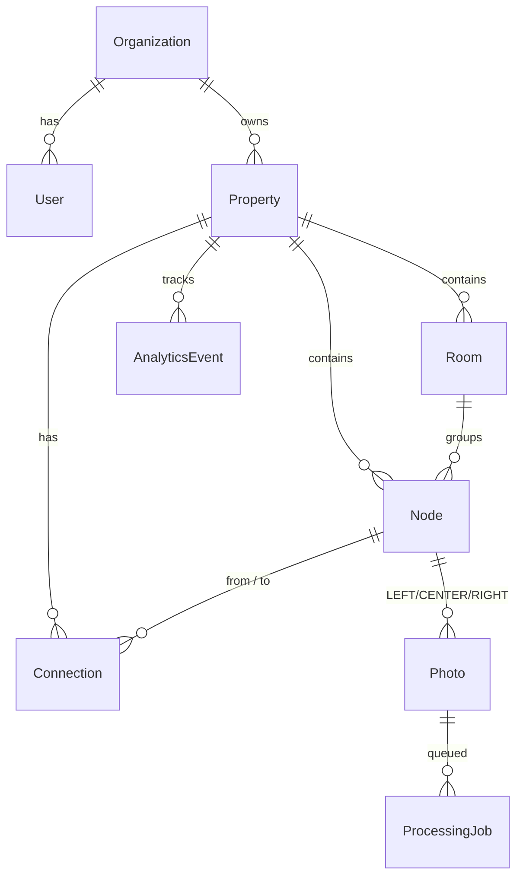
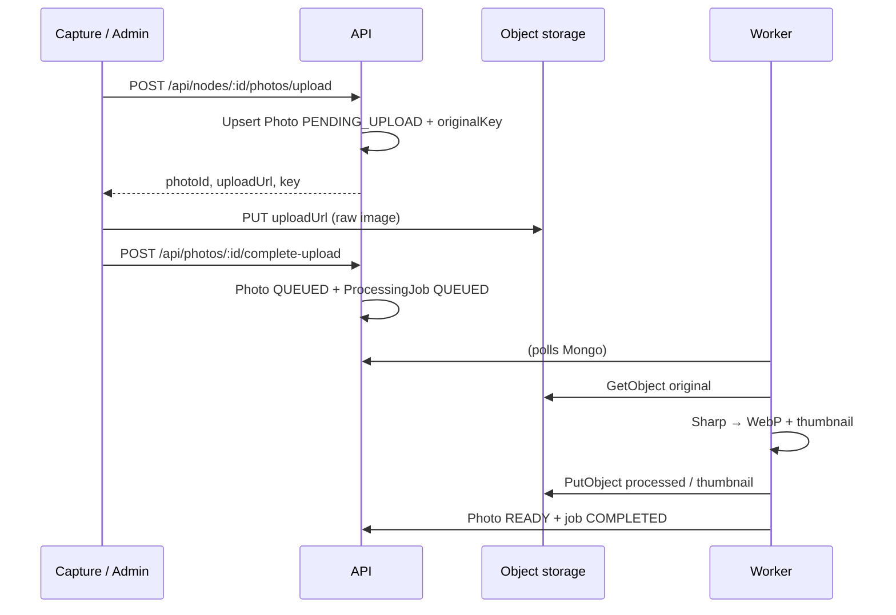

# Architecture

Viewra is a multi-tenant platform for **photographic spatial navigation**: discrete capture nodes linked by a directed graph, each node holding LEFT / CENTER / RIGHT photos. Visitors walk the published graph in a web viewer; there is no reconstructed 3D mesh.

## High-level diagram



## Domain graph model



### Hierarchy

| Level | Role |
|-------|------|
| **Organization** | Tenant boundary. Users and properties belong to one org. |
| **Property** | A walkthrough unit with `slug` (org-scoped) and immutable `publicId` for public URLs. |
| **Room** | Logical grouping (kitchen, hallway, …) with display `order`. |
| **Node** | Capture viewpoint inside a room. Holds approximate 2D map position and status. |
| **Photo** | One of LEFT / CENTER / RIGHT per node (unique). Storage keys for original / processed / thumbnail. |
| **Connection** | Directed edge `fromNodeId → toNodeId` with a navigation `direction` (FORWARD, LEFT, …). Optional bidirectional create. |

The viewer starts at a published property’s entry node and follows connections. Map overlay uses each node’s `approximatePosition` — layout hints only, not metric 3D coordinates.

## Services

| Package | Responsibility |
|---------|----------------|
| `@viewra/api` | Auth (JWT access + hashed refresh tokens), org/user CRUD, property graph CRUD, presigned upload, publish/archive, public tours, analytics ingest, dashboard stats. |
| `@viewra/worker` | Polls `ProcessingJob` (QUEUED / FAILED with backoff), downloads original from S3, Sharp rotate + resize → WebP processed + thumbnail, updates `Photo` to READY / FAILED. |
| `@viewra/admin` | Org dashboard: properties, rooms, graph editor, photo status, publish validation, QR link to viewer. |
| `@viewra/viewer` | Public SPA at `/tour/:publicId` — photographic stage, nav arrows, room label, optional map jump, analytics beacons. |
| `apps/capture` + `CaptureCore` | Operator capture on device: session graph mutations, quality validation stubs, offline upload queue with retry. |

Shared libraries: `@viewra/types` (Zod models/enums), `@viewra/shared` (slug, publicId, graph publish validation, storage key layout).

## Upload pipeline (presigned S3)



Object keys follow:

```text
{organizationId}/{propertyId}/{original|processed|thumbnail}/{photoId}.{ext}
```

Presigned PUT URLs expire in 15 minutes by default. Public tour responses use `S3_PUBLIC_URL` + key (path-style MinIO / R2 public bucket / CDN).

## Multi-tenancy

- Every `User` and `Property` has `organizationId`.
- JWT payload includes `organizationId` and `role` (`SUPER_ADMIN` | `ADMIN` | `CAPTURE_OPERATOR`).
- Non–super-admin queries are scoped with `orgScopeFilter` / `findOrgProperty` (and room/node/photo helpers). Missing or cross-tenant IDs return **404**, not 403, to avoid leaking existence.
- `SUPER_ADMIN` can list all orgs/users/properties; create-org is super-admin only. Publish/archive/analytics require ADMIN or SUPER_ADMIN.
- Public tour routes (`/api/tours/:publicId…`) are unauthenticated and only return **PUBLISHED** properties (ARCHIVED → 410).

## Why photographic navigation, not 3D

Viewra deliberately stores **viewpoint photos + a navigation graph**, not a mesh or point cloud:

1. **Capture cost** — Operators shoot three framed photos per node with a phone; no LiDAR/photogrammetry pipeline or specialized hardware.
2. **Deterministic UX** — Visitors see real photography with clear LEFT/CENTER/RIGHT framing and explicit arrows, instead of free-look 3D that can feel disorienting on mobile.
3. **Ops reliability** — Processing is resize/encode (Sharp), not reconstruction. Failures are per-photo and retriable (`reprocess`).
4. **Branching floor plans** — Hallways and loops are first-class graph edges (`createBranch`, `returnToNode`, `connectExistingNode`) without requiring metric alignment of rooms in 3D space.
5. **CDN-friendly** — Tours are static image URLs + a small JSON graph; easy to cache and serve worldwide.

Approximate `(x, y)` positions exist only for admin graph layout and the viewer map overlay — they are not used for perspective warping or slam.

## Related docs

- [database.md](./database.md) — schemas and indexes
- [api.md](./api.md) — REST surface
- [capture-workflow.md](./capture-workflow.md) — iOS / CaptureCore
- [deployment.md](./deployment.md) — run in production
