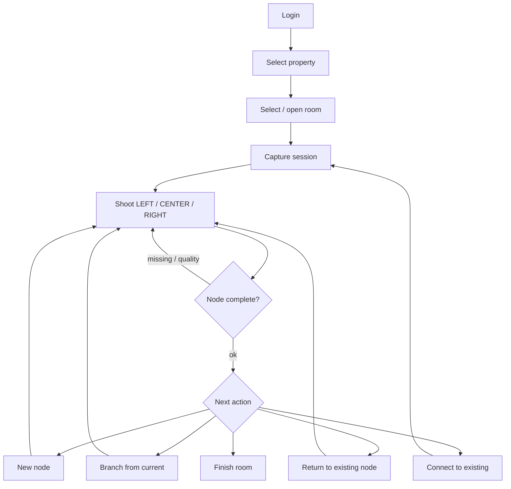

# Capture workflow

The iOS app (`apps/capture`) is the operator client. Platform-independent logic lives in **CaptureCore** (`packages/CaptureCore`) — no UIKit / AVFoundation — so graph rules, validation, and the offline queue can be unit-tested with `swift test`.

## Operator flow (iOS)



1. **Login** — `POST /api/auth/login` (seed operator: `operator@viewra.local`).
2. **Property → room** — list properties/rooms via authenticated API; start a capture session for a room.
3. **Shoot directions** — AVFoundation camera captures LEFT, CENTER, RIGHT for the current node. CaptureCore tracks `completedPhotos` / `CaptureSessionState`.
4. **Validate** — `CaptureValidator` requires all three directions; dark/blurry stubs raise overrideable warnings (`useAnyway`).
5. **After a complete node**, the UI offers:
   - **New Node** — create next node and auto-connect from current (`GraphService.createNode`).
   - **Branch** — stay conceptually at origin, create child with explicit direction (`createBranch`).
   - **Return** — set an existing node as current without copying (`returnToNode`).
   - **Connect Existing** — edge from current (or explicit from) to another node (`connectExistingNode`), optional reverse.
   - **Finish Room** — end session for that room.
6. **Graph view** — adjacency for picking return targets; connect-existing lists nodes (grouped by room in the app).
7. **Offline queue banner** — pending/failed uploads with retry progress.

Default API base URL: `http://localhost:3001` (`APIClient.defaultBaseURL`). Build with XcodeGen:

```bash
cd apps/capture && xcodegen generate && open ViewraCapture.xcodeproj
```

## Branching and return-to-node

CaptureCore models the property as an in-memory `GraphStore` (nodes + connections + `currentNodeId`).

| Operation | Behavior |
|-----------|----------|
| `createNode` | Appends node (`CAPTURING`), optionally connects from previous/current with a direction (default `FORWARD`), sets current. |
| `createBranch` | Ensures origin exists, sets current to origin, then `createNode` connected from that origin (hallway side trips, loops). |
| `returnToNode` | Sets `currentNodeId` to an **existing** node — does not duplicate photos or nodes. Operator can re-shoot missing directions or branch again. |
| `connectExistingNode` | Adds directed edge; optional `bidirectional` adds reverse (`BACK` when used). |
| `deleteNode` | Removes node and incident edges; current falls back to last remaining node. |

Server-side, creating a node with `connectFromNodeId` on `POST /api/properties/:id/nodes` (or `POST /api/connections`) persists the same graph shape for admin/viewer.

## Offline upload queue

Photos may be captured without reliable connectivity. CaptureCore `OfflineUploadQueue`:

1. **Enqueue** — write image bytes under local `FileStorage` (`queue/payloads/{id}.bin`), append `UploadQueueItem` (`pending`) to persisted `queue/manifest.json`.
2. **Process due** — for `pending` or `failed` past `nextRetryAt`, mark `uploading`, call injected `UploadTransport.upload`, then `succeeded` (delete payload) or schedule retry.
3. **Retry** — `UploadRetryPolicy` (default max 5 attempts, exponential backoff from 1s, cap 60s, optional jitter). Exhaustion → `OfflineUploadError.maxRetriesExceeded`.
4. **Progress** — aggregate `bytesUploaded / fileSize` across non-cancelled items; app shows banner counts (`pendingCount` / `failedCount`).

The iOS transport typically:

1. `POST /api/nodes/:id/photos/upload` → `uploadUrl`
2. `PUT` image to the presigned URL
3. `POST /api/photos/:id/complete-upload`

so the API worker can process when the device is back online.

## CaptureCore responsibilities

| Module | Role |
|--------|------|
| `Models` | Shared domain types: Property, Room, Node, Connection, PhotoDirection, statuses — aligned with `@viewra/types` string enums. |
| `CaptureSessionState` | Session snapshot: property/room, nodes, connections, current node photo completion. |
| `GraphStore` / `GraphService` | In-memory graph mutations: create, branch, return, connect, adjacency. |
| `CaptureValidator` | Required LEFT/CENTER/RIGHT; dark/blur warnings with `canUseAnyway` / `useAnyway`. |
| `OfflineUploadQueue` + `UploadRetryPolicy` + `FileStorage` | Durable offline queue, backoff, pluggable `UploadTransport`. |

**Out of scope for CaptureCore:** camera capture, SwiftUI, networking HTTP clients, JWT storage — those live in `apps/capture`.

## Tests

```bash
cd packages/CaptureCore && swift test
```

Coverage includes graph acceptance (branch/return/connect), validator, and offline queue retry behavior.
